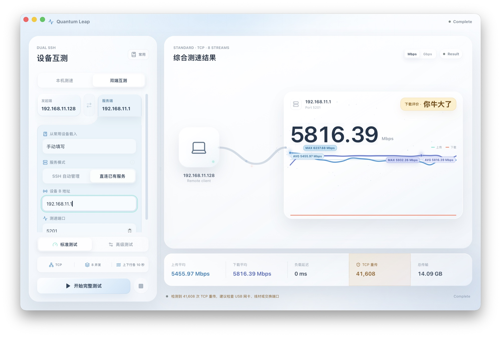
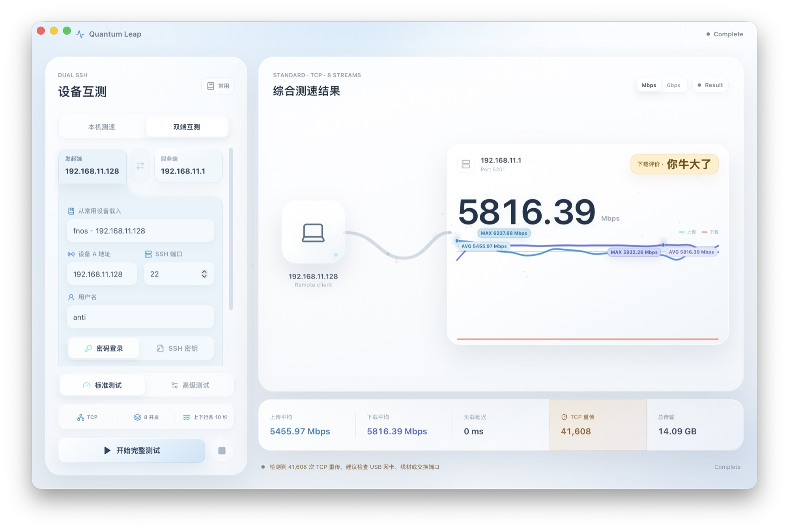
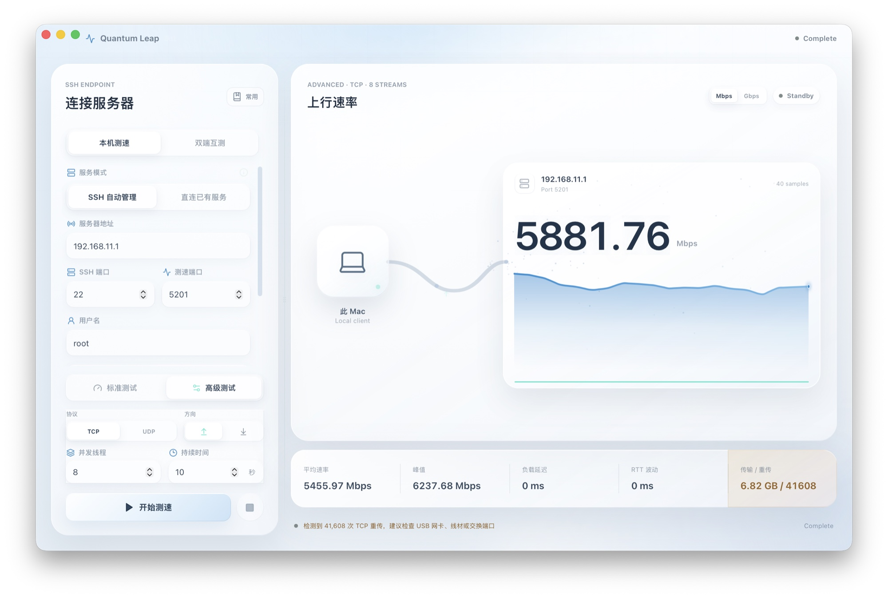
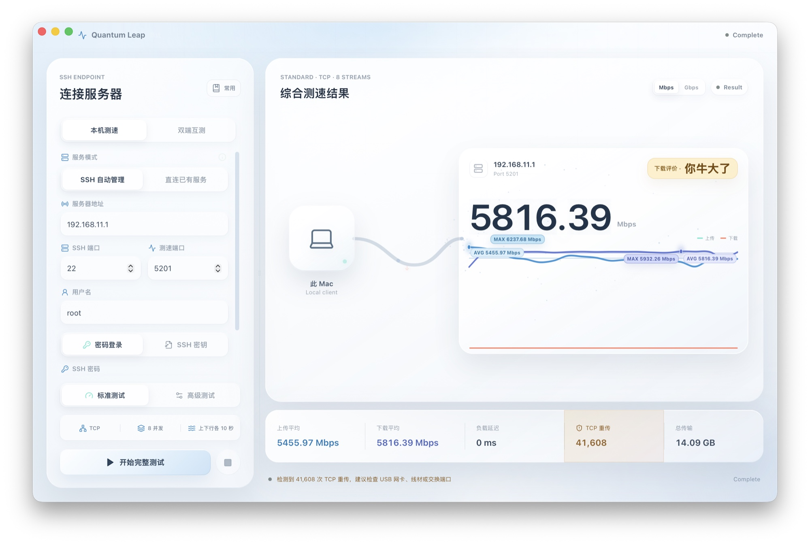
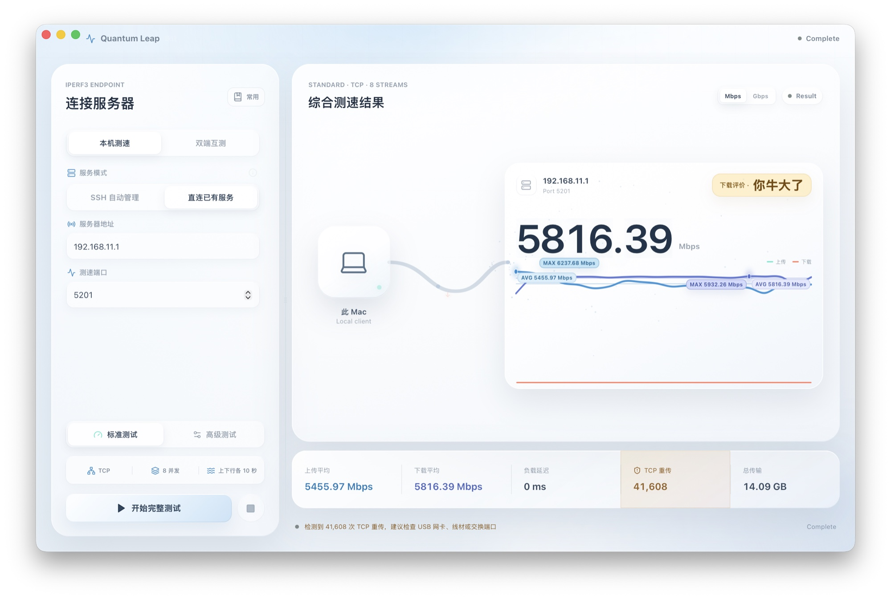

<div align="center">
  
  <h1>Quantum Leap（跃迁）</h1>
  <p>为 macOS 打造的现代化 iperf3 网络性能测试工具</p>
  <p>
    <a href="https://github.com/Anti2077/Quantum-Leap/releases/latest"></a>
    
    
    <a href="LICENSE"></a>
  </p>
  <p>
    <a href="https://github.com/Anti2077/Quantum-Leap/releases/latest"><strong>下载最新版本</strong></a>
  </p>
</div>



Quantum Leap 将 SSH 远程管理、`iperf3` 测速和实时可视化整合在一个原生桌面工作台中。它既能测试 Mac 与远端设备之间的链路，也能让两台远端设备直接互测；双端模式下，流量在设备 A 与设备 B 之间传输，不经过 Mac。

## 两种测速拓扑

| 模式 | 流量路径 | 适合场景 |
| --- | --- | --- |
| **本机测速** | Mac ↔ 远端服务器 | 宽带、局域网、NAS 与云服务器测试；支持 SSH 自动管理或直连已有服务 |
| **双端互测** | 设备 A ↔ 设备 B | 两台 NAS、服务器或异地设备间的真实链路测试；Mac 仅负责编排与展示 |

双端互测支持分别配置两端 SSH 凭据、自定义 `iperf3` 路径，并可一键交换 A/B 方向。应用会管理远端客户端与服务端的生命周期，在停止、失败或切换测试时执行安全清理。

## 功能亮点

- **灵活连接**：本机测速、双 SSH 设备互测、直连已有 `iperf3` 服务
- **完整认证**：密码、私钥和私钥口令；保存的敏感凭据统一存储在 macOS Keychain
- **远端兼容**：支持自定义绝对路径，并自动搜索 `PATH`、QNAP `/opt/bin/iperf3` 与常见 Entware 位置
- **实时反馈**：带宽曲线、平均与峰值速率、传输量、RTT、抖动、丢包和 TCP 重传
- **质量诊断**：展示 TCP 重传次数，并在重传异常偏高时提示可能的链路问题
- **标准与高级测试**：标准模式自动完成上传/下载；高级模式支持 TCP/UDP、方向、并发数和时长设置
- **新旧版本兼容**：`iperf3` 3.17+ 优先使用 JSON 流；旧版本自动回退到文本间隔输出
- **安全进程管理**：复用前明确确认，只清理由当前会话启动且与 PID、端口匹配的远端进程
- **工作台体验**：可调整连接区与结果区宽度，支持浅色、深色和跟随系统外观

## 界面预览

### 双端互测

分别配置两台远端设备，测试流量直接在两端之间运行。



### 本机高级测试

按需选择 TCP/UDP、上传/下载、并发数和测试时长。



### SSH 认证

使用密码或私钥登录；需要时可填写私钥口令和远端 `iperf3` 路径。



### 直连已有服务

无需 SSH 凭据，直接连接 Docker、`systemd` 或其他方式常驻的 `iperf3 -s` 服务。



## 系统要求

- macOS 13 Ventura 或更高版本
- Apple Silicon Mac（M1/M2/M3/M4 及后续机型）
- 本机与远端建议安装 `iperf3` 3.12 或更高版本
- SSH 自动管理模式需要账户能够启动和终止自己的 `iperf3` 进程
- 直连模式需要目标地址上已有可访问的 `iperf3 -s` 服务

本机依次查找 `PATH`、`/opt/homebrew/bin/iperf3` 和 `/usr/local/bin/iperf3`，也可以通过 `IPERF3_PATH` 指定路径。远端支持自动探测常见安装位置或手动填写绝对路径。

## 安装

1. 从 [Releases](https://github.com/Anti2077/Quantum-Leap/releases/latest) 下载 `Quantum-Leap_1.2.0_macOS_arm64.dmg`。
2. 打开 DMG，将 **Quantum Leap** 拖入 **Applications**。
3. 确认参与测速的设备均可执行 `iperf3 --version`。

当前公开构建使用 ad-hoc 签名，尚未经过 Apple Developer ID 公证。macOS 首次启动若阻止运行，请在 Finder 中右键应用并选择“打开”，或前往“系统设置 → 隐私与安全性”确认打开。Release 同时提供 SHA-256 校验文件。

## 使用方式

在顶部选择 **本机测速** 或 **双端互测**：

- **本机测速 / SSH 自动管理**：填写远端 SSH 信息，应用负责启动、复用和清理服务。
- **本机测速 / 直连已有服务**：只填写服务器地址与测速端口，应用不会终止已有服务。
- **双端互测**：分别填写设备 A 与设备 B 的 SSH 信息，应用在一端启动客户端、另一端启动服务端。

标准测试固定使用 TCP、8 并发，依次执行 10 秒上传和 10 秒下载。高级测试支持 TCP/UDP、1–32 并发以及 3–120 秒或持续运行；UDP 使用 `-b 0` 进行不限速测试。

## 安全设计

- SSH 密码和私钥口令不会写入日志或普通配置文件。
- 保存连接时，密码与私钥口令进入 macOS Keychain；旧版本条目会按需迁移到统一凭据库。
- 已记录主机的 SSH 密钥发生变化时，应用显示 SHA-256 指纹并要求本次明确确认。
- 目标端口已有服务时，应用会询问是否复用；直连或复用的持久服务不会被终止。
- 临时服务清理前会核验进程命令、服务端模式和端口，清理失败会明确报告。

## 贡献者

特别感谢 [Micro-ATP](https://github.com/Micro-ATP) 的贡献：[PR #1](https://github.com/Anti2077/Quantum-Leap/pull/1) 改进了远端 `iperf3` 路径探测、QNAP/Entware 兼容和 TCP 重传诊断，[PR #3](https://github.com/Anti2077/Quantum-Leap/pull/3) 带来了双 SSH 设备互测与完整的远端进程生命周期管理。

欢迎通过 [Issues](https://github.com/Anti2077/Quantum-Leap/issues) 报告问题，也欢迎提交 Pull Request。

## 本地开发

需要 Node.js 20+、Rust stable、Xcode Command Line Tools 和 `iperf3` 3.12+。

```bash
npm install
npm run tauri:dev
```

验证与构建：

```bash
npm run build
npx tsc --noEmit
cd src-tauri
cargo test --locked
cargo clippy --locked -- -D warnings
```

## 技术栈

- Tauri 2 + Rust：桌面容器、SSH 会话、进程管理与实时事件
- React 18 + TypeScript：界面与测速状态机
- Tailwind CSS + Framer Motion：响应式布局与交互动效
- `ssh2` + macOS Keychain：远端控制与凭据存储

## 开源许可

Copyright (C) 2026 Anti2077

Quantum Leap 以 [GNU General Public License v3.0 only](LICENSE) 发布。你可以使用、研究、修改和分发源码；分发原版或修改版时，需要继续以 GPLv3 提供对应源码和许可证声明。本软件不提供任何担保，完整条款以 `LICENSE` 为准。
