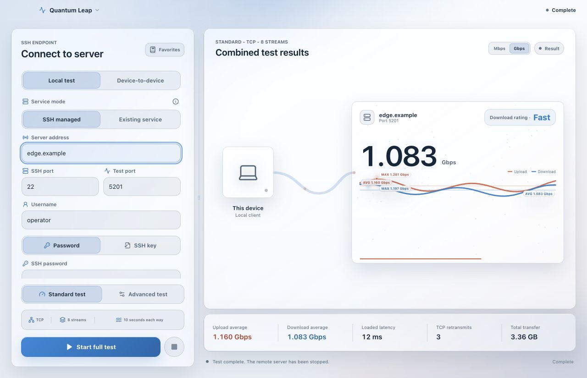
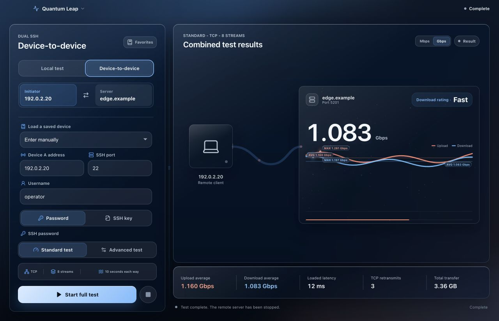
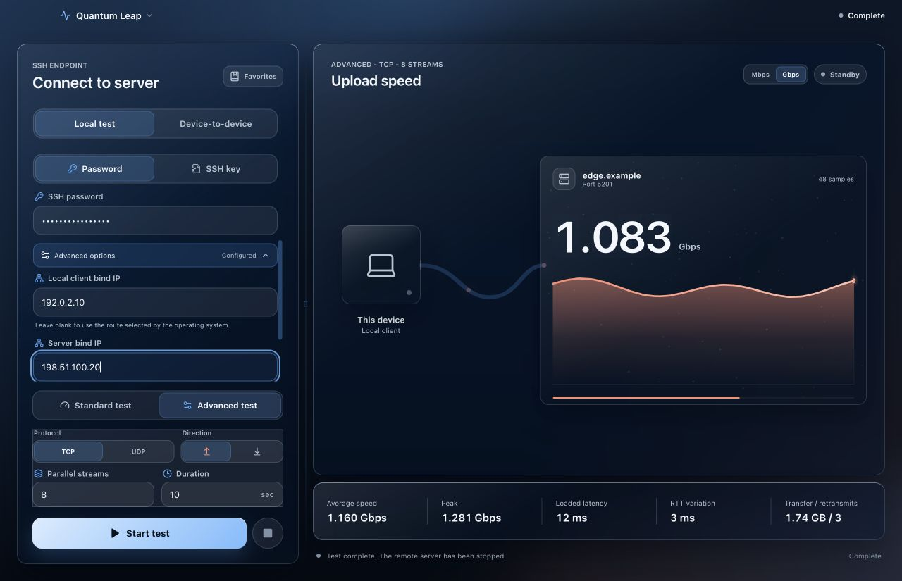

<p align="center">
  <a href="README.md"><strong>English</strong></a> · <a href="README.zh-CN.md">简体中文</a>
</p>

<div align="center">
  
  <h1>Quantum Leap</h1>
  <p>A modern iperf3 network performance workbench for macOS, Windows, and Linux.</p>
  <p>
    <a href="https://github.com/Anti2077/Quantum-Leap/releases/latest"></a>
    
    
    
    
    <a href="LICENSE"></a>
  </p>
  <p><a href="https://github.com/Anti2077/Quantum-Leap/releases/latest"><strong>Download the latest release</strong></a></p>
</div>



Quantum Leap combines SSH orchestration, `iperf3` testing, and live visualization in one native desktop workspace. Test the link between this computer and a remote server, or coordinate a direct test between two remote devices without routing test traffic through the local machine.

## Why Quantum Leap

| | Capability | What it gives you |
| --- | --- | --- |
| **01** | Flexible topologies | Local-to-remote tests, two remote SSH endpoints, or a direct connection to an existing `iperf3 -s` service |
| **02** | Live measurements | Bandwidth curves, average and peak throughput, transfer totals, RTT, jitter, loss, and TCP retransmissions |
| **03** | Controlled automation | Remote service startup, reuse confirmation, session-owned cleanup, and SSH host-key verification |
| **04** | Cross-platform workflow | Native credential storage, English and Simplified Chinese UI, light/dark themes, and responsive layouts |

Additional controls include TCP/UDP selection, upload/download direction, 1-32 parallel streams, timed or continuous tests, custom remote `iperf3` paths, and per-endpoint IPv4/IPv6 binding.

## Test Topologies

| Mode | Traffic path | Best for |
| --- | --- | --- |
| **Local test** | This computer ↔ remote server | Broadband, LAN, NAS, and cloud-server checks through SSH management or an existing service |
| **Device-to-device** | Device A ↔ Device B | Testing the real path between two NAS devices, servers, or sites while this computer only orchestrates and displays |

In device-to-device mode, each endpoint has independent SSH credentials, bind addresses, and an optional custom `iperf3` path. Endpoints can be swapped with one action, and temporary remote processes are cleaned up when a test stops, fails, or changes mode.

## Interface Tour

### Configure both ends of the path

Set the initiator and server independently, load saved endpoints, and swap the test direction without rebuilding the connection.



### Tune the test and network binding

Choose TCP or UDP, transfer direction, concurrency, duration, and the exact local or remote IP used for test traffic.



## Workflows

- **Local test / SSH managed:** provide the remote SSH connection; Quantum Leap starts, reuses, and safely cleans up the test service.
- **Local test / Existing service:** connect directly to a persistent Docker, `systemd`, or manually started `iperf3 -s`; Quantum Leap does not stop that service.
- **Device-to-device:** provide two SSH endpoints; one runs the client and the other runs the server while the local app coordinates the session.

The standard profile runs TCP with 8 streams, testing upload and download for 10 seconds each. Advanced mode supports TCP or UDP, either direction, 1-32 streams, and 3-120 seconds or continuous operation. UDP uses `-b 0` for an unlimited target bitrate.

## Install

The current public release is **Quantum Leap 1.3.1** for macOS ARM64, Windows x64, and Linux x64.

1. Open [Releases](https://github.com/Anti2077/Quantum-Leap/releases/latest) and download the package for your platform.
2. On macOS, open the DMG and drag **Quantum Leap** into **Applications**. On Windows, run the NSIS installer. On Linux, use the AppImage or install the DEB package.
3. macOS and remote devices must provide `iperf3`; Windows and Linux local tests use the bundled `iperf3` sidecar by default.

The public macOS build is ad-hoc signed and is not notarized with Apple Developer ID. If macOS blocks the first launch, right-click the app in Finder and choose **Open**, or allow it under **System Settings -> Privacy & Security**. The Release also includes a SHA-256 checksum file.

Windows NSIS, Linux AppImage, and Linux DEB packages are published as unsigned Release assets. Windows may show a SmartScreen warning; verify downloads against the attached SHA-256 manifest before installing.

The cross-platform build workflow also produces unsigned Linux ARM64 AppImage and DEB artifacts for pull requests, `main` pushes, and manual runs. Actions artifacts are retained for 14 days and are not GitHub Release assets.

## Requirements

- macOS 13 Ventura or later, Windows 10/11 x64, or an x64 Ubuntu/Debian desktop using glibc
- `iperf3` 3.12 or later is recommended on macOS and all remote devices
- Windows and Linux local tests use a bundled, source-pinned `iperf3` 3.21 sidecar by default
- Linux credential storage requires a desktop Secret Service provider
- SSH-managed accounts must be able to start and stop their own `iperf3` processes
- SSH-managed and device-to-device remote endpoints require a POSIX shell; Windows remote endpoints are not currently supported
- Existing-service mode requires a reachable `iperf3 -s` listener on the target address and port

Set `IPERF3_PATH` to override the local binary on any platform. On macOS, Quantum Leap also searches `PATH`, `/opt/homebrew/bin/iperf3`, and `/usr/local/bin/iperf3`. Remote endpoints can use automatic discovery or an absolute custom path, including common QNAP and Entware locations.

## Security

- SSH passwords and private-key passphrases are never written to logs or ordinary configuration files.
- Saved credentials use macOS Keychain, Windows Credential Manager, or Linux Secret Service.
- A changed SSH host key displays its SHA-256 fingerprint and requires explicit confirmation for that connection.
- Existing or reused persistent services are left running after a test.
- Before terminating a temporary service, Quantum Leap verifies the process command, server mode, port, and session ownership.

## Development

Install Node.js 20+, Rust stable, and the Tauri prerequisites for your platform. macOS development also needs Xcode Command Line Tools and local `iperf3` 3.12+.

```bash
npm install
npm run tauri:dev
```

Before packaging on Linux or Windows, run `npm run sidecar:linux` or `npm run sidecar:windows`. The Linux script builds the sidecar for the native x64 or ARM64 host. The Windows sidecar build requires Cygwin with GCC, make, autoconf, automake, and curl. Generated binaries and DLLs are stored in the ignored `src-tauri/binaries/` directory.

Validation commands:

```bash
npm run typecheck
npm run test
npm run build
cargo test --manifest-path src-tauri/Cargo.toml --locked
cargo clippy --manifest-path src-tauri/Cargo.toml --locked -- -D warnings
```

## Technology

- **Tauri 2 + Rust:** native desktop shell, SSH sessions, process control, credential integration, and live events
- **React 18 + TypeScript:** interface, state machine, charts, and responsive workspace behavior
- **CSS + Framer Motion:** glass surfaces, light/dark themes, transitions, and reduced-motion support
- **libssh2 + native credential stores:** remote control and secure platform-specific secret storage

## Contributors

Special thanks to [Micro-ATP](https://github.com/Micro-ATP): [PR #1](https://github.com/Anti2077/Quantum-Leap/pull/1) improved remote `iperf3` discovery, QNAP/Entware compatibility, and TCP retransmission diagnostics; [PR #3](https://github.com/Anti2077/Quantum-Leap/pull/3) added two-SSH-device testing and full remote process lifecycle management.

Bug reports and pull requests are welcome through [Issues](https://github.com/Anti2077/Quantum-Leap/issues) and the repository contribution workflow.

## License

Copyright (C) 2026 Anti2077

Quantum Leap is distributed under the [GNU General Public License v3.0 only](LICENSE). You may use, study, modify, and redistribute it under the terms of GPLv3; redistributed original or modified versions must continue to provide the corresponding source and license notice. The software is provided without warranty. Third-party component notices are available in [THIRD_PARTY_NOTICES.md](THIRD_PARTY_NOTICES.md).
