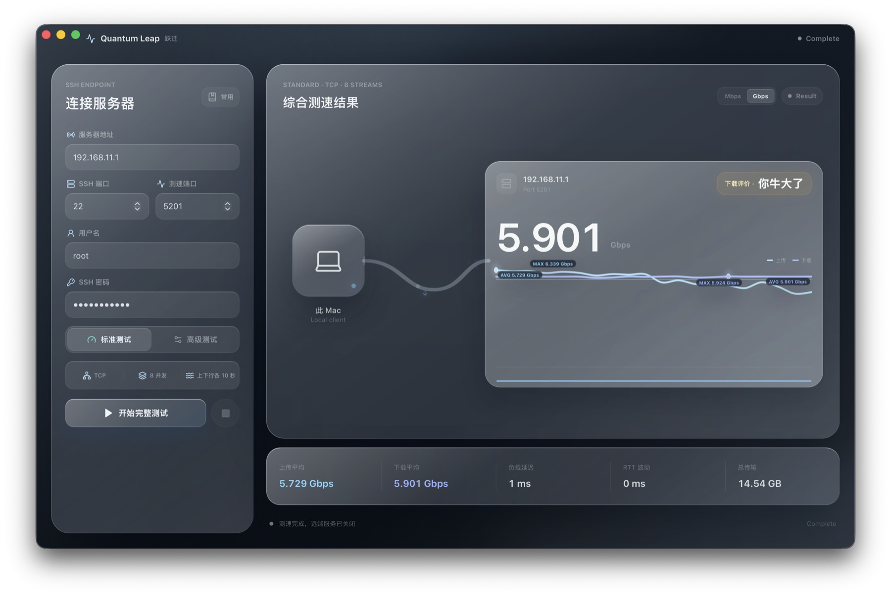
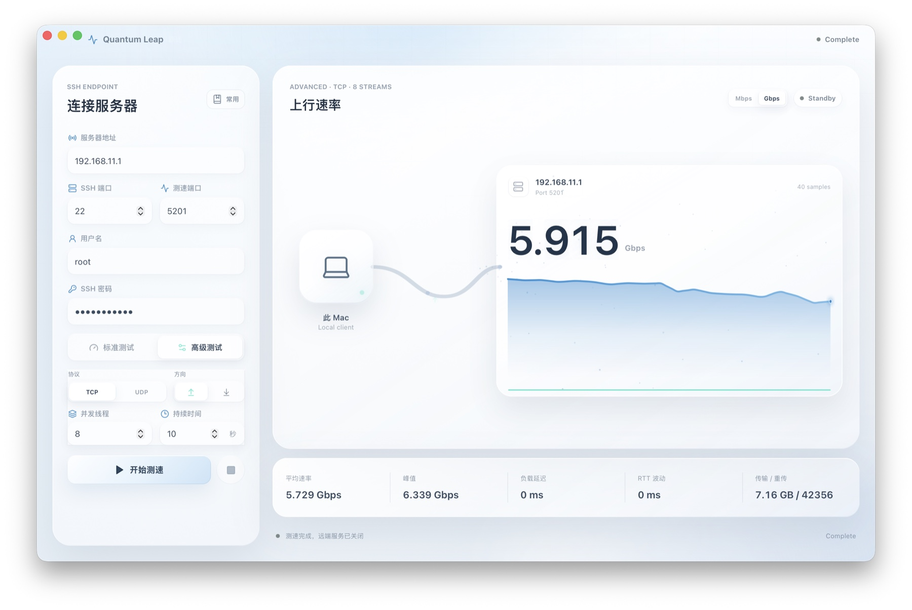
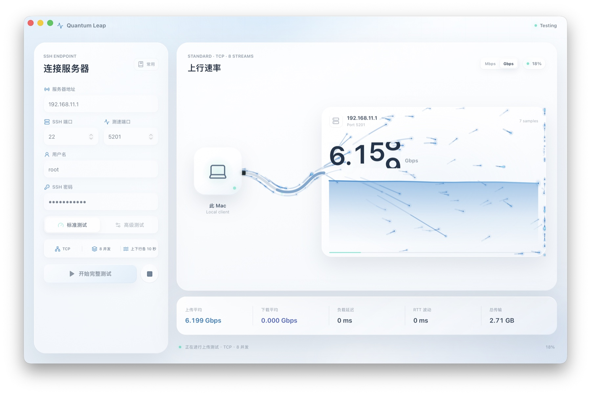
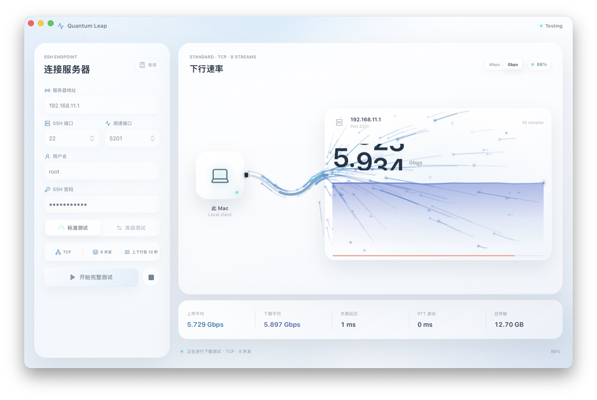

# Quantum Leap (跃迁)

一款面向 macOS 的原生网络带宽测试工具。Quantum Leap 可以通过 SSH 管理远端 `iperf3`，也可以直连已有服务，用实时曲线、双向对比和关键质量指标呈现 TCP/UDP 测速结果。

[](https://github.com/Anti2077/Quantum-Leap/releases/latest)


> [下载最新版本](https://github.com/Anti2077/Quantum-Leap/releases/latest) · 当前提供 Apple Silicon (`arm64`) DMG。


## 运行效果

| 深色模式 | 高级测试 |
| --- | --- |
|  |  |

| 实时上传 | 实时下载 |
| --- | --- |
|  |  |

## 主要功能

- 支持 SSH 自动管理与直连已有 `iperf3` 服务两种连接模式
- SSH 支持密码和私钥认证，私钥可使用可选口令
- 常用服务器支持 48 字符以内备注，旧版本配置自动兼容
- 自动识别远端常见包管理器，提供可复制的 `iperf3` 安装命令和重新检测
- 服务不可达时显示目标地址与端口，区分直连服务和 SSH 管理模式
- 只清理由当前会话启动且匹配 PID/端口的远端 `iperf3` 进程
- 标准测试固定使用 TCP、8 并发，依次完成 10 秒上传与 10 秒下载
- 高级测试支持 TCP/UDP、上传/下载、1–32 并发及 3–120 秒或持续运行
- 实时带宽曲线、平均速率、峰值、总传输量、RTT、抖动与 TCP 重传统计
- 双向测试完成后提供上传/下载对比曲线和下载速率评级
- 常用服务器信息持久化，密码或私钥口令保存到 macOS Keychain
- 浅色、深色和跟随系统三种外观模式
- 已占用测速端口与 SSH 主机密钥变化均需用户明确确认

## 系统要求

- macOS 13 Ventura 或更高版本
- 当前 Release：Apple Silicon Mac（M1/M2/M3/M4 及后续机型）
- 本机与远端服务器均安装 `iperf3` 3.17 或更高版本
- SSH 自动管理模式需要密码或私钥认证，并允许该账户启动和终止自己的 `iperf3` 进程
- 直连模式需要目标地址上已有可访问的 `iperf3 -s` 服务，不需要 SSH 凭据

本机按 `PATH`、`/opt/homebrew/bin/iperf3`、`/usr/local/bin/iperf3` 的顺序查找程序，也可通过 `IPERF3_PATH` 指定路径。

## 安装

1. 从 [Releases](https://github.com/Anti2077/Quantum-Leap/releases/latest) 下载 `Quantum-Leap_1.1.1_macOS_arm64.dmg`。
2. 打开 DMG，将 **Quantum Leap** 拖入 **Applications**。
3. 确认本机和远端均可执行 `iperf3 --version`。

当前版本使用 ad-hoc 签名，未经过 Apple Developer ID 公证。macOS 首次启动若阻止运行，请在 Finder 中右键应用并选择“打开”，或前往“系统设置 → 隐私与安全性”确认打开。发布页同时提供 SHA-256 校验文件。

DMG 使用 Quantum Leap 专用背景图和拖拽布局，打开镜像后可直接将应用拖入 Applications。

## 使用方式

先选择服务模式：

- **SSH 自动管理**：填写 SSH 与测速端口、用户名，并选择密码或 SSH 私钥认证。应用负责启动、复用和清理远端服务。
- **直连已有服务**：只需填写服务器地址与测速端口，适用于 Docker、权限受限环境或由 `systemd` 等方式持久运行的服务；应用不会终止该服务。

标准测试会自动执行上传和下载两个阶段。高级测试可以单独选择方向和协议；UDP 使用 `-b 0` 进行不限速测试，时长设为 `0` 时会持续运行，直到手动停止。

标准测试的下载评级规则：

| 下载平均速率 | 评级 |
| --- | --- |
| `< 50 Mbps` | 拉完了 |
| `50–799 Mbps` | NPC |
| `800 Mbps–1.99 Gbps` | 人上人 |
| `2–2.5 Gbps` | 夯 |
| `> 2.5 Gbps` | 你牛大了 |

## 安全设计

- SSH 密码和私钥口令只在当前 Rust 进程内存中使用，不写入日志或普通配置文件。
- 保存常用服务器时，非敏感字段及私钥路径写入 Tauri 应用配置目录，密码或私钥口令写入 macOS Keychain。
- 已记录在 `~/.ssh/known_hosts` 中的主机若密钥不匹配，应用显示当前 SHA-256 指纹并要求仅本次确认，不修改 `known_hosts`。
- 目标端口已有 `iperf3` 服务时，应用先询问是否复用；直连或复用的持久服务不会被终止。
- 对本次启动的临时服务，清理前会同时核验进程命令、服务端模式和测速端口，失败时明确报告而不是静默忽略。

## 本地开发

需要 Node.js 20+、Rust stable、Xcode Command Line Tools 和 `iperf3` 3.17+。

```bash
npm install
npm run tauri:dev
```

生产构建与检查：

```bash
npm run build
cd src-tauri
cargo test --locked
cargo clippy --locked -- -D warnings
cd ..
npm run tauri:build
```

## 技术栈

- Tauri 2 + Rust：桌面容器、SSH 会话、进程管理与实时事件
- React 18 + TypeScript：界面与测速状态机
- Tailwind CSS + Framer Motion：响应式布局和交互动效
- `ssh2` + macOS Keychain：远端控制与凭证存储

## 开源许可

Copyright (C) 2026 Anti2077

Quantum Leap 以 [GNU General Public License v3.0 only](LICENSE) 发布。你可以将其用于个人或商业用途，也可以查看、修改和分发源码；如果分发原版或修改版，必须继续以 GPLv3 提供对应源码和许可证声明。本软件不提供任何担保，完整条款以 `LICENSE` 为准。

## 项目结构

```text
src/                  React 前端
src/components/       工作台、实时图表与可视化组件
src/lib/              Tauri API、类型、主题和格式化
src-tauri/src/        Rust 后端、SSH、iperf3 与 Keychain
src-tauri/icons/      桌面应用图标
docs/                 截图与 Release 说明
```

`iperf3 -J` 只在测试结束后输出一次 JSON，无法驱动实时曲线。本项目使用 `--json-stream -i 1`，因此要求 `iperf3` 3.17 或更高版本。
