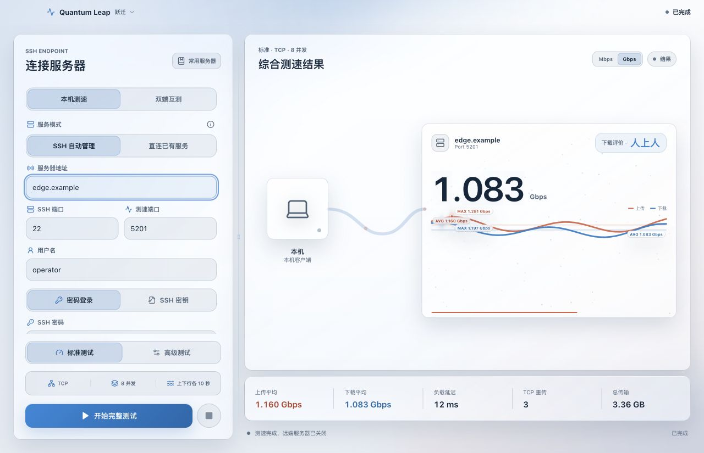
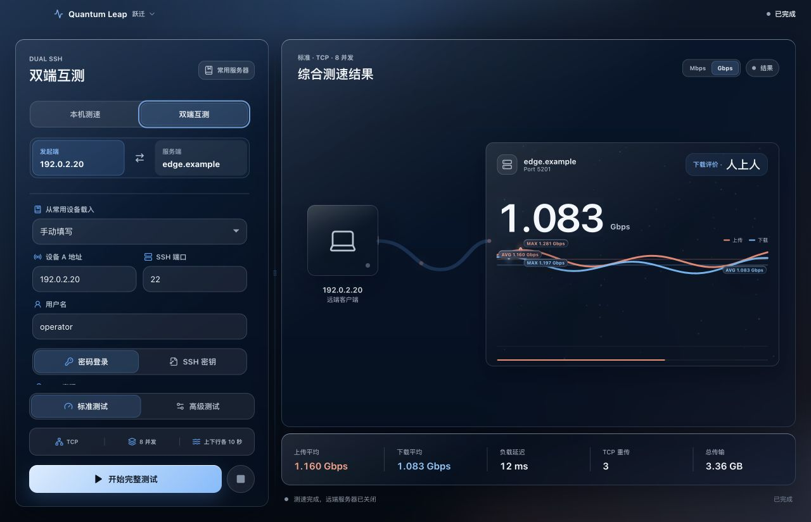
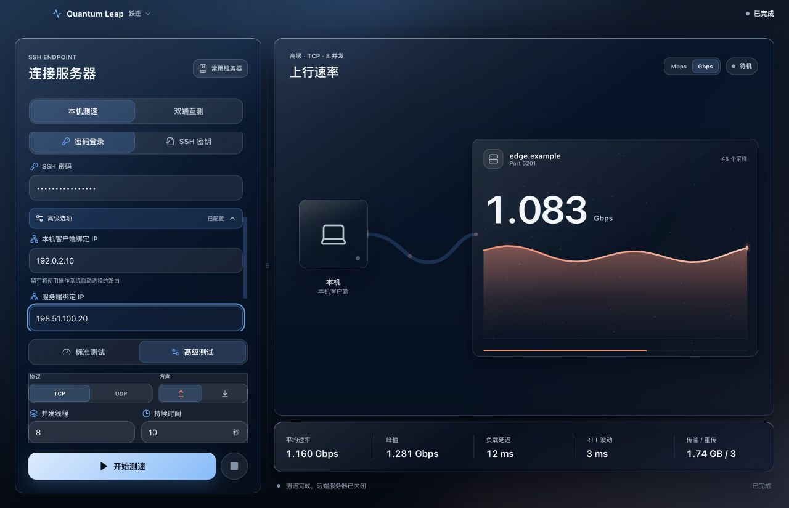

<p align="center">
  <a href="README.md">English</a> · <a href="README.zh-CN.md"><strong>简体中文</strong></a>
</p>

<div align="center">
  
  <h1>Quantum Leap（跃迁）</h1>
  <p>面向 macOS、Windows 与 Linux 的现代化 iperf3 网络性能测试工作台。</p>
  <p>
    <a href="https://github.com/Anti2077/Quantum-Leap/releases/latest"></a>
    
    
    
    
    <a href="LICENSE"></a>
  </p>
  <p><a href="https://github.com/Anti2077/Quantum-Leap/releases/latest"><strong>下载最新版本</strong></a></p>
</div>



Quantum Leap 将 SSH 远程编排、`iperf3` 测速和实时可视化整合在一个原生桌面工作台中。你既可以测试本机与远端服务器之间的链路，也可以让两台远端设备直接互测；双端模式下，测速流量不会绕行本机。

## 为什么选择 Quantum Leap

| | 能力 | 带来的体验 |
| --- | --- | --- |
| **01** | 灵活测速拓扑 | 本机到远端、两台远端 SSH 设备互测，或直连已有 `iperf3 -s` 服务 |
| **02** | 实时性能数据 | 带宽曲线、平均与峰值速率、传输量、RTT、抖动、丢包和 TCP 重传 |
| **03** | 可控自动化 | 远端服务启动、复用确认、会话进程清理与 SSH 主机密钥验证 |
| **04** | 跨平台工作流 | 原生凭据存储、中英双语、浅色/深色主题与响应式布局 |

更多控制包括 TCP/UDP、上传/下载方向、1–32 并发、定时或持续测速、自定义远端 `iperf3` 路径，以及每个端点独立的 IPv4/IPv6 绑定地址。

## 测速拓扑

| 模式 | 流量路径 | 适合场景 |
| --- | --- | --- |
| **本机测速** | 本机 ↔ 远端服务器 | 宽带、局域网、NAS 与云服务器测试；可通过 SSH 自动管理或直连已有服务 |
| **双端互测** | 设备 A ↔ 设备 B | 测试两台 NAS、服务器或异地设备之间的真实链路；本机只负责编排与展示 |

双端互测为每个端点提供独立的 SSH 凭据、绑定地址和可选 `iperf3` 自定义路径。你可以一键交换两端方向；测速停止、失败或切换模式时，应用会安全清理由当前会话启动的临时远端进程。

## 界面预览

### 独立配置链路两端

分别设置发起端与服务端，从常用设备载入参数，并在无需重建连接的情况下交换测速方向。



### 调整测试参数与网络绑定

按需选择 TCP/UDP、传输方向、并发数、持续时间，以及测速流量使用的本机或远端 IP。



## 使用方式

- **本机测速 / SSH 自动管理：**填写远端 SSH 连接，Quantum Leap 负责启动、复用并安全清理测速服务。
- **本机测速 / 直连已有服务：**直接连接 Docker、`systemd` 或手动启动的持久 `iperf3 -s`；Quantum Leap 不会终止该服务。
- **双端互测：**填写两个 SSH 端点，一端运行客户端、另一端运行服务端，本机应用负责编排整个会话。

标准模式固定使用 TCP 和 8 并发，依次执行 10 秒上传和 10 秒下载。高级模式支持 TCP/UDP、任一方向、1–32 并发，以及 3–120 秒或持续运行；UDP 使用 `-b 0` 进行不限速测试。

## 安装

当前公开 Release 是面向 macOS ARM64、Windows x64 与 Linux x64 的 **Quantum Leap 1.3.1**。

1. 打开 [Releases](https://github.com/Anti2077/Quantum-Leap/releases/latest)，下载对应平台的软件包。
2. macOS 打开 DMG 后将 **Quantum Leap** 拖入 **Applications**；Windows 运行 NSIS 安装程序；Linux 可运行 AppImage 或安装 DEB 软件包。
3. macOS 与远端设备需要自行提供 `iperf3`；Windows/Linux 本机测速默认使用安装包内置的 `iperf3` sidecar。

当前公开 macOS 构建使用 ad-hoc 签名，尚未通过 Apple Developer ID 公证。macOS 首次启动若阻止运行，请在 Finder 中右键应用并选择**打开**，或前往**系统设置 -> 隐私与安全性**确认打开。Release 同时提供 SHA-256 校验文件。

Windows NSIS、Linux AppImage 与 Linux DEB 作为未签名的正式 Release 附件发布。Windows 可能出现 SmartScreen 提示，安装前请使用随 Release 提供的 SHA-256 清单校验下载文件。

跨平台构建工作流还会在 Pull Request、`main` 推送和手动运行时生成未签名的 Linux ARM64 AppImage 与 DEB 制品。Actions 制品保留 14 天，不属于 GitHub Release 附件。

## 系统要求

- macOS 13 Ventura 或更高版本、Windows 10/11 x64，或使用 glibc 的 Ubuntu/Debian x64 桌面环境
- macOS 本机及所有远端设备建议安装 `iperf3` 3.12 或更高版本
- Windows/Linux 本机测速默认使用安装包内置、固定源码版本的 `iperf3` 3.21 sidecar
- Linux 保存敏感凭据需要桌面环境提供 Secret Service
- SSH 自动管理账户需要能够启动和终止自己的 `iperf3` 进程
- SSH 自动管理与双端互测的远端设备需要 POSIX shell；目前不支持 Windows 远端端点
- 直连已有服务模式需要目标地址与端口上存在可访问的 `iperf3 -s`

三平台均可通过 `IPERF3_PATH` 覆盖本机二进制。macOS 还会依次搜索 `PATH`、`/opt/homebrew/bin/iperf3` 和 `/usr/local/bin/iperf3`。远端设备可以自动探测，也可以填写绝对路径，包括 QNAP 与 Entware 的常见安装位置。

## 安全设计

- SSH 密码和私钥口令不会写入日志或普通配置文件。
- 保存的凭据进入 macOS Keychain、Windows Credential Manager 或 Linux Secret Service。
- 已记录主机的 SSH 密钥发生变化时，应用会展示 SHA-256 指纹，并要求本次连接明确确认。
- 直连或明确复用的持久服务在测速结束后保持运行。
- 终止临时服务前，Quantum Leap 会核验进程命令、服务端模式、端口和会话归属。

## 本地开发

需要 Node.js 20+、Rust stable 以及对应平台的 Tauri 构建依赖。macOS 开发还需要 Xcode Command Line Tools 和本机 `iperf3` 3.12+。

```bash
npm install
npm run tauri:dev
```

Linux/Windows 打包前分别运行 `npm run sidecar:linux` 或 `npm run sidecar:windows`。Linux 脚本会根据当前 x64 或 ARM64 宿主机原生构建 sidecar；Windows sidecar 构建需要 Cygwin 的 GCC、make、autoconf、automake 和 curl。生成的二进制与 DLL 位于被 Git 忽略的 `src-tauri/binaries/` 目录。

验证命令：

```bash
npm run typecheck
npm run test
npm run build
cargo test --manifest-path src-tauri/Cargo.toml --locked
cargo clippy --manifest-path src-tauri/Cargo.toml --locked -- -D warnings
```

## 技术栈

- **Tauri 2 + Rust：**原生桌面容器、SSH 会话、进程控制、凭据集成与实时事件
- **React 18 + TypeScript：**界面、测速状态机、图表和响应式工作台行为
- **CSS + Framer Motion：**玻璃质感、浅色/深色主题、过渡动画与减少动态效果支持
- **libssh2 + 系统原生凭据库：**远端控制与平台安全存储

## 贡献者

特别感谢 [Micro-ATP](https://github.com/Micro-ATP)：[PR #1](https://github.com/Anti2077/Quantum-Leap/pull/1) 改进了远端 `iperf3` 路径探测、QNAP/Entware 兼容和 TCP 重传诊断；[PR #3](https://github.com/Anti2077/Quantum-Leap/pull/3) 带来了双 SSH 设备互测与完整的远端进程生命周期管理。

欢迎通过 [Issues](https://github.com/Anti2077/Quantum-Leap/issues) 报告问题，也欢迎提交 Pull Request。

## 开源许可

Copyright (C) 2026 Anti2077

Quantum Leap 以 [GNU General Public License v3.0 only](LICENSE) 发布。你可以按照 GPLv3 使用、研究、修改和分发源码；分发原版或修改版时，需要继续提供对应源码和许可证声明。本软件不提供任何担保。第三方组件说明见 [THIRD_PARTY_NOTICES.md](THIRD_PARTY_NOTICES.md)。
